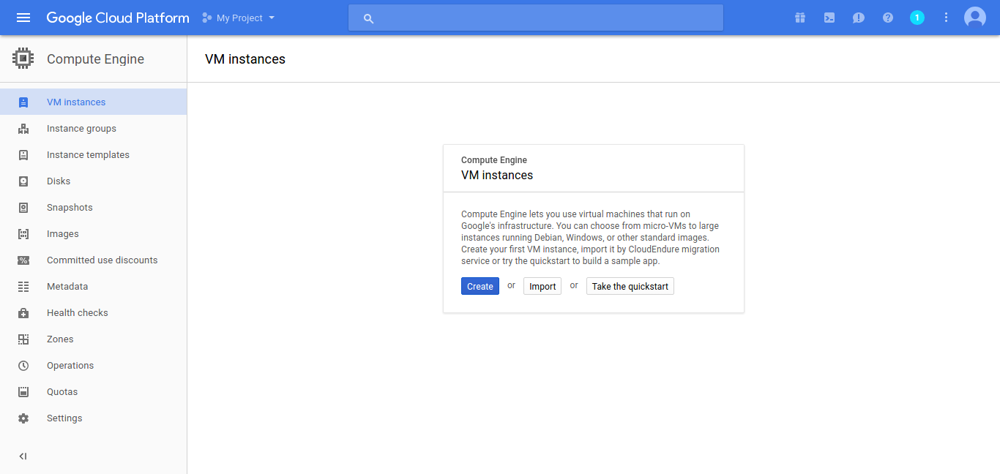
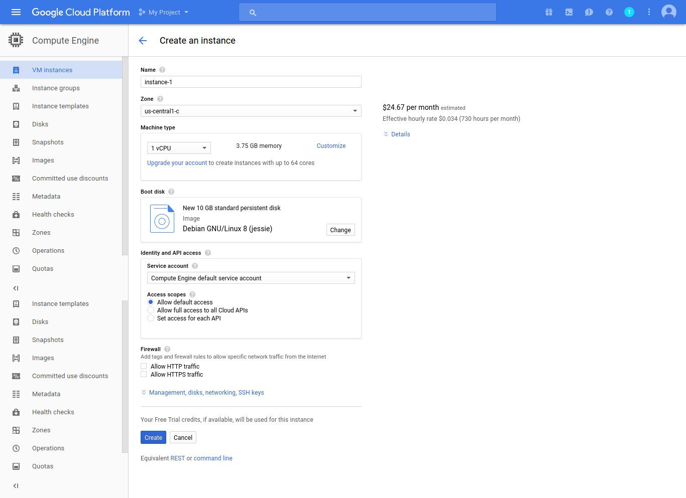
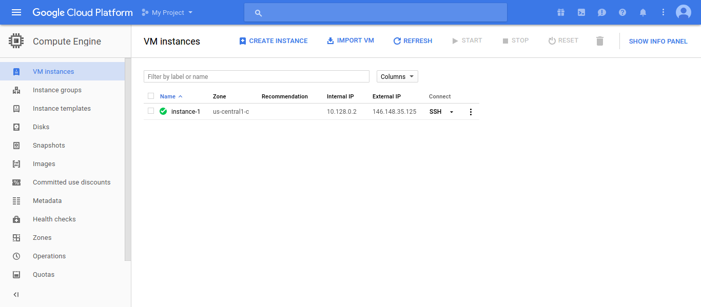
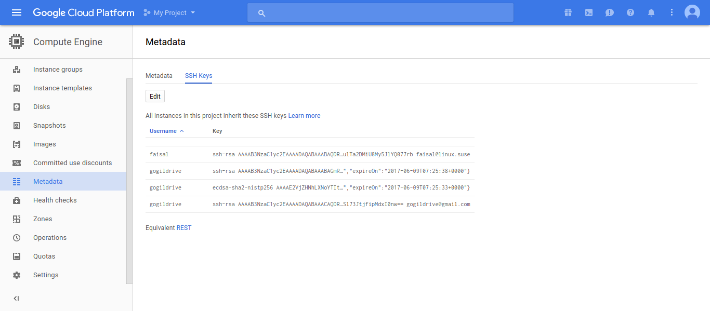
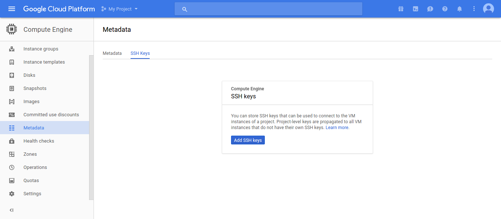

+++
title = "Setting Ansible Pada Google Cloud Rngine"
subtitle = ""

# Add a summary to display on homepage (optional).
summary = "Menggunakan ansible untuk orchestration pada instance google cloud engine. Artikel ini akan menggunakan fresh install ansible pada ubuntu."

date = 2019-04-04T17:06:33+07:00
draft = false

# Authors. Comma separated list, e.g. `["Bob Smith", "David Jones"]`.
authors = []

# Is this a featured post? (true/false)
featured = false

# Tags and categories
# For example, use `tags = []` for no tags, or the form `tags = ["A Tag", "Another Tag"]` for one or more tags.
tags = []
categories = []

# Projects (optional).
#   Associate this post with one or more of your projects.
#   Simply enter your project's folder or file name without extension.
#   E.g. `projects = ["deep-learning"]` references 
#   `content/project/deep-learning/index.md`.
#   Otherwise, set `projects = []`.
# projects = ["internal-project"]

# Featured image
# To use, add an image named `featured.jpg/png` to your page's folder. 
[image]
  # Caption (optional)
  caption = ""

  # Focal point (optional)
  # Options: Smart, Center, TopLeft, Top, TopRight, Left, Right, BottomLeft, Bottom, BottomRight
  focal_point = ""
+++
Menggunakan ansible untuk orchestration pada instance google cloud engine.
Artikel ini akan menggunakan fresh install ansible pada ubuntu.

## Installing ansible

Install ansible using pip

```bash
python -m pip install ansible
```

## Create instance google cloud engine





## Upload ssh-key

Pada mesin yang diinstall ansible kita harus meng-upload ssh-key public `.ssh/id_rsa.pub` ke google compute engine metadata





## Setting host ansible

Edit atau buat file di `/etc/ansible/hosts`, lalu masukan ip external instance.

```bash
faisal@faisal:~$ "146.148.35.125" >> /etc/ansible/hosts 
```

## Check koneksi

test koneksi ke instance dengan module ping di ansible.

```bash
faisal@faisal:~$ ansible all -m ping
The authenticity of host '146.148.35.125 (146.148.35.125)' can't be established.
ECDSA key fingerprint is SHA256:pvBVz0J2e9dpeMnQDMjRQlhpucbuNB1hhoQkMM27bsQ.
Are you sure you want to continue connecting (yes/no)? yes
146.148.35.125 | SUCCESS => {
    "changed": false, 
    "ping": "pong"
}
faisal@faisal:~$ 
```

Jika response success maka ansible sudah terkoneksi dengan benar di google cloud engine